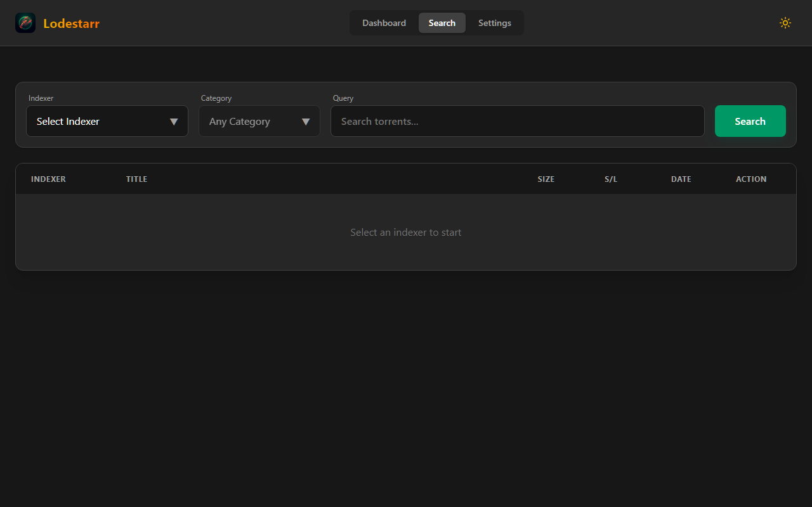

# Lodestarr

<p align="center">
  
</p>

**Lodestarr** is a powerful, lightweight indexer aggregator and proxy for Torznab-compatible sources. Built with **Rust** for performance and **React** for a modern user experience, it unifies search results from multiple indexers into a single, responsive interface.

---

## Why Lodestarr?

| Feature | Lodestarr | Jackett | Prowlarr |
|---------|-----------|---------|----------|
| **Language/Runtime** | **Rust (native binary)** | C# (.NET) | C# (.NET) |
| **Memory Usage** | ~15-30 MB | ~100-300 MB | ~150-400 MB |
| **Startup Time** | Instant (<1s) | 5-15s | 10-30s |
| **Native Indexer Support** | ✅ Uses Jackett YAML definitions | ✅ Built-in | ✅ Built-in |
| **Proxied Indexers** | ✅ Torznab proxy | ✅ Torznab feed | ✅ Torznab + Newznab |
| **Query Caching** | ✅ SQLite-backed (1hr TTL) | ✅ Yes | ❌ No |
| **CLI/TUI Interface** | ✅ Full TUI + CLI | ❌ Web only | ❌ Web only |
| **Docker Image Size** | ~125 MB | ~300 MB | ~400 MB |
| **Raspberry Pi Optimized** | ✅ Native ARM64 | ⚠️ Heavy | ⚠️ Heavy |
| **Arr App Integration** | ✅ Torznab API | ✅ | ✅ Auto-sync |
| **Usenet Support** | ❌ Torrents only(for now) | ⚠️ Limited | ✅ Full |

### Key Differentiators

- **🦀 Rust Performance**: Single binary with no runtime dependencies. Perfect for low-power devices.
  
- **🖥️ Terminal-First**: Full TUI (Terminal UI) and CLI for headless servers. Search, browse, and download without ever opening a browser.

- **🔌 Jackett Compatibility**: Uses Jackett's battle-tested YAML indexer definitions directly. If it works in Jackett, it works in Lodestarr.

- **📦 Minimal Footprint**: ~125MB Docker image vs 300-400MB for alternatives. Uses ~20MB RAM at idle vs 100-300MB.

---

## Feature Overview

### ⚡ Performance & Efficiency
- **Blazing Fast**: Native Rust binary with async I/O for maximum throughput
- **Low Resource Usage**: Ideal for Raspberry Pi, NAS devices, and VPS instances
- **Smart Caching**: SQLite-backed result caching with configurable TTL (default: 1 hour)

### 🔍 Unified Search
- **Aggregate Results**: Query all indexers simultaneously with a single search
- **Advanced Filtering**: Filter by indexer, category, size, or text
- **Sorting Options**: Sort by name, size, seeders, leechers, or date
- **Pagination**: Handle large result sets with built-in pagination

### 🧩 Native Indexer Support
- **Jackett Definitions**: Download and use indexer definitions directly from the [Jackett repository](https://github.com/Jackett/Jackett)
- **YAML-Based Config**: Human-readable indexer configurations
- **One-Click Install**: Browse and install indexers from the web UI
- **Auto-Updates**: Keep indexer definitions current

### 🔌 Proxied Indexer Support
- **Torznab Proxy**: Connect to any Torznab-compatible source (Jackett, Prowlarr, etc.)
- **Unified Interface**: Mix native and proxied indexers seamlessly
- **Easy Configuration**: Simple forms for adding external indexers

### 💾 Persistence & History
- **SQLite Database**: All data persists across restarts
- **Search Logs**: Complete history of every search query
- **Statistics**: Track indexer performance and usage patterns
- **Configuration Storage**: Robust settings management

### 📱 Modern Web UI
- **Dark/Light Themes**: System-aware theme with manual override
- **Responsive Layout**: Works on desktop, tablet, and mobile
- **Real-Time Dashboard**: Live metrics, activity feed, and indexer status

### 🖥️ CLI & TUI
- **Full CLI**: Script searches and automate workflows
- **Interactive TUI**: Rich terminal interface for browsing results
- **Magnet/Torrent Downloads**: Download directly from command line

### 🔐 Sonarr/Radarr Compatible
- **Torznab API**: Standard `/api/v2.0` endpoints
- **Capability Reporting**: Full `/caps` endpoint support
- **Category Mapping**: Proper category translation for *arr apps

---

## Screenshots

### Dashboard
The command center with real-time metrics, activity feed, and system health.


### Unified Search
Aggregate results from all indexers with powerful filtering and sorting.



### Indexer Management
Browse, install, and configure native and proxied indexers.


---

## Installation

### 🐳 Docker (Recommended)

Multi-architecture images for `linux/amd64` and `linux/arm64`.

#### Docker Compose

```yaml
services:
  lodestarr:
    image: ghcr.io/ddonindia/lodestarr:latest
    container_name: lodestarr
    ports:
      - "3420:3420"
    volumes:
      - ~/.config/lodestarr:/root/.config/lodestarr
    restart: unless-stopped
```

```bash
docker-compose up -d
```

Access the dashboard at `http://localhost:3420`.

#### Docker Run

```bash
docker run -d \
  --name lodestarr \
  -p 3420:3420 \
  -v ~/.config/lodestarr:/root/.config/lodestarr \
  ghcr.io/ddonindia/lodestarr:latest
```

### 🛠️ Build from Source

**Prerequisites**: Rust (latest stable) and Node.js 18+.

```bash
git clone https://github.com/ddonindia/lodestarr.git
cd lodestarr
cargo build --release
./target/release/lodestarr serve
```

---

## Configuration

Configuration is stored in `config.toml`:
- **Linux**: `~/.config/lodestarr/config.toml`

### Database Path

```toml
# config.toml
db_path = "/custom/path/to/lodestarr.db"
```

### Logging

```bash
RUST_LOG=debug ./lodestarr serve
```

---

## CLI Usage

### Search

```bash
# Basic search
lodestarr search "ubuntu iso"

# TV search with season/episode
lodestarr search "Game of Thrones" -t tvsearch --season 1 --ep 1

```

### Indexer Management

```bash
# List installed native indexers
lodestarr indexer list

# List proxied indexers
lodestarr indexer list --proxied

# Download indexers from Jackett
lodestarr indexer download --list              # Browse available
lodestarr indexer download --names yts,eztv    # Install specific
lodestarr indexer download --all               # Install all

# Test an indexer
lodestarr indexer test yts --query "test"
```

### TUI Mode

```bash
# Launch interactive terminal UI
lodestarr tui
```

---

## API

Lodestarr provides a Torznab-compatible API for integration with Sonarr, Radarr, Lidarr, etc.

| Endpoint | Description |
|----------|-------------|
| `/api/v2.0/indexers/all/caps` | Capabilities for all indexers |
| `/api/v2.0/search?q=query&t=search` | Unified search across all indexers |
| `/api/info` | Server information and version |
| `/api/search` | Web UI search endpoint |
| `/api/stats` | Server statistics |

### Add to Sonarr/Radarr

1. Go to **Settings → Indexers → Add**
2. Select **Torznab**
3. Set URL: `http://localhost:3420/api/v2.0/indexers/all`
4. API Key: (leave empty or use any value)

---

## Architecture

```
┌─────────────────────────────────────────────────────────────┐
│                      Lodestarr                               │
├─────────────────────────────────────────────────────────────┤
│  ┌─────────────┐  ┌─────────────┐  ┌─────────────────────┐  │
│  │   Web UI    │  │    CLI      │  │        TUI          │  │
│  │   (React)   │  │   (Clap)    │  │     (Ratatui)       │  │
│  └──────┬──────┘  └──────┬──────┘  └──────────┬──────────┘  │
│         │                │                     │             │
│         └────────────────┼─────────────────────┘             │
│                          ▼                                   │
│  ┌───────────────────────────────────────────────────────┐  │
│  │                   Axum HTTP Server                     │  │
│  │                   (Torznab API)                        │  │
│  └───────────────────────┬───────────────────────────────┘  │
│                          ▼                                   │
│  ┌───────────────────────────────────────────────────────┐  │
│  │               Search & Aggregation Layer               │  │
│  │         (Caching, Dedup, Timeout Management)           │  │
│  └───────────────────────┬───────────────────────────────┘  │
│                          ▼                                   │
│  ┌─────────────────┐    ┌─────────────────┐                 │
│  │ Native Indexers │    │ Proxied Indexers│                 │
│  │ (Jackett YAML)  │    │   (Torznab)     │                 │
│  └────────┬────────┘    └────────┬────────┘                 │
│           │                      │                           │
│           └──────────┬───────────┘                           │
│                      ▼                                       │
│  ┌───────────────────────────────────────────────────────┐  │
│  │                   SQLite Database                       │ │
│  │          (Config, Cache, History, Stats)                │ │
│  └───────────────────────────────────────────────────────┘  │
└─────────────────────────────────────────────────────────────┘
```

---

## When to Use Lodestarr vs Alternatives

### Use Lodestarr when:
- Running on **Raspberry Pi** or low-power devices
- You want **minimal resource usage** (RAM/CPU/disk)
- You prefer **CLI/TUI** for headless servers
- You need **fast repeat searches** (caching)
- You want a **single binary** with no dependencies

### Use Jackett when:
- You need **maximum indexer compatibility**
- You're already in the .NET ecosystem
- You have plenty of server resources

### Use Prowlarr when:
- You want **auto-sync** with *arr applications
- You need **Usenet** indexer support
- You prefer the *arr app ecosystem

---

## ⚠️ Disclaimer

This project is provided for **educational purposes only**. Lodestarr does not promote, encourage, or condone piracy or the unauthorized distribution of copyrighted material. Users are solely responsible for ensuring their use of this software complies with all applicable laws in their jurisdiction. The developers assume no liability for misuse of this tool.

---

## License

MIT License by ddonindia.
