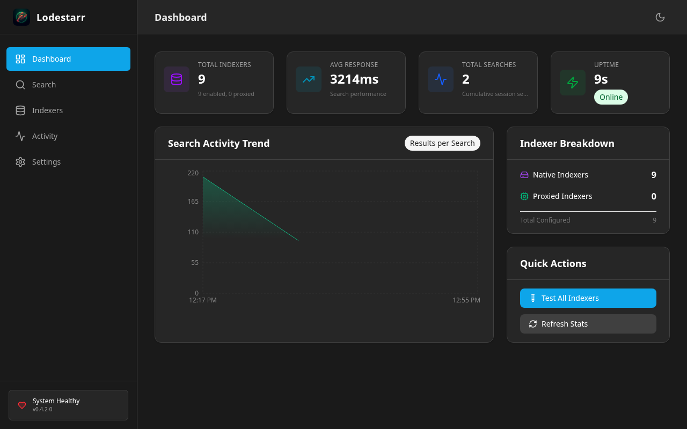
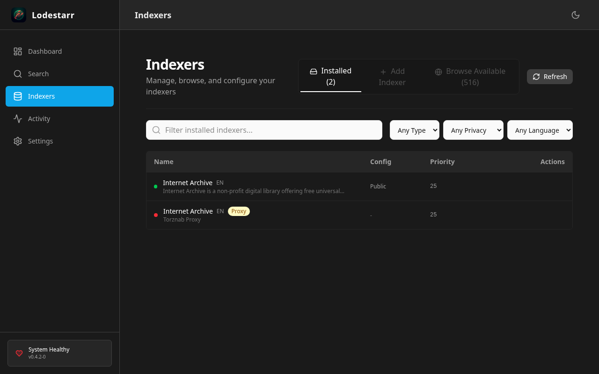
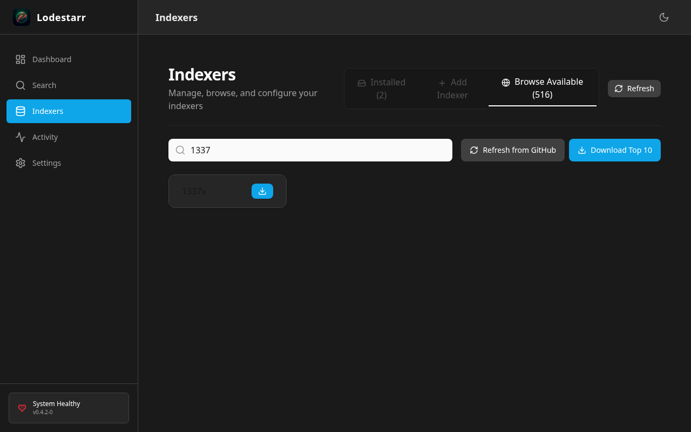
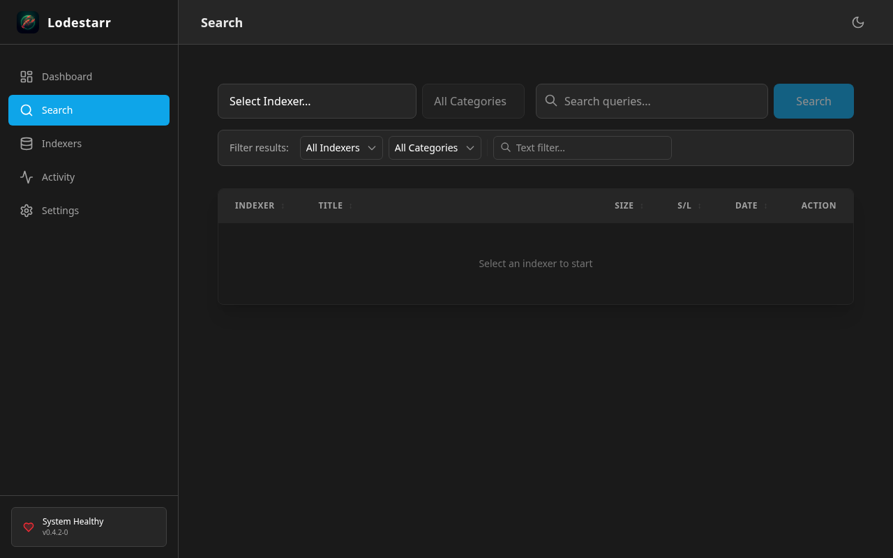

# Lodestarr Demo Walkthrough

A complete end-to-end guide from building Docker containers to running UI tests and capturing screenshots.

---

## Table of Contents

1. [Prerequisites](#prerequisites)
2. [Building the Docker Container](#building-the-docker-container)
3. [Running the Application](#running-the-application)
4. [Setting Up the Test Environment](#setting-up-the-test-environment)
5. [Running the Demo Tests](#running-the-demo-tests)
6. [Understanding the Test Coverage](#understanding-the-test-coverage)
7. [Screenshots Reference](#screenshots-reference)
8. [Troubleshooting](#troubleshooting)

---

## Prerequisites

### System Requirements

| Component | Requirement |
|-----------|-------------|
| **OS** | Linux (Debian/Ubuntu recommended), macOS, or Windows with WSL2 |
| **Docker** | Docker 20.10+ with BuildKit enabled |
| **Node.js** | v20+ (for running UI tests) |
| **Chromium** | Required for Puppeteer tests |
| **RAM** | 2GB minimum (4GB recommended for building) |

### Install Dependencies

```bash
# Ubuntu/Debian
sudo apt update
sudo apt install -y docker.io nodejs npm chromium

# Enable Docker for your user
sudo usermod -aG docker $USER
```

---

## Building the Docker Container

### Option 1: Build Locally

```bash
# Clone the repository
git clone https://github.com/ddonindia/lodestarr.git
cd lodestarr

# Build the Docker image
docker build -t lodestarr:local .
```

The Dockerfile uses a multi-stage build:

| Stage | Purpose |
|-------|---------|
| **frontend** | Builds React UI with Vite |
| **backend** | Compiles Rust binary with embedded assets |
| **runtime** | Minimal Debian image with just the binary |

### Option 2: Pull Pre-built Image

```bash
docker pull ghcr.io/ddonindia/lodestarr:latest
```

### Verify the Build

```bash
docker images | grep lodestarr
# Should show: lodestarr:local or ghcr.io/ddonindia/lodestarr
```

---

## Running the Application

### Using Docker Run

```bash
# Create config directory
mkdir -p ~/.config/lodestarr

# Run the container
docker run -d \
  --name lodestarr \
  -p 3420:3420 \
  -v ~/.config/lodestarr:/root/.config/lodestarr \
  lodestarr:local
```

### Using Docker Compose

Create `docker-compose.yml`:

```yaml
services:
  lodestarr:
    image: lodestarr:local
    container_name: lodestarr
    ports:
      - "3420:3420"
    volumes:
      - ~/.config/lodestarr:/root/.config/lodestarr
    environment:
      - RUST_LOG=info
    restart: unless-stopped
```

Start the service:

```bash
docker-compose up -d
```

### Verify the Server

```bash
# Check container logs
docker logs lodestarr

# Test the API
curl http://localhost:3420/api/info
# Expected: {"name":"Lodestarr","version":"0.4.2"}

# Open in browser
open http://localhost:3420  # macOS
xdg-open http://localhost:3420  # Linux
```

---

## Setting Up the Test Environment

### Install Test Dependencies

```bash
cd web
npm install
```

### Configure Chromium Path (if needed)

```bash
# Find Chromium executable
which chromium || which chromium-browser

# Set environment variable if not at default path
export PUPPETEER_EXECUTABLE_PATH=/usr/bin/chromium
```

**Note**: The test suite automatically starts and stops a test server on a dynamic port. No manual backend setup required.

---

## Running the Demo Tests

### Full Demo Walkthrough (40 Tests)

```bash
cd web

# Run in headless mode (default)
npm test -- demo_walkthrough.test.ts

# Run with visible browser (for debugging)
HEADLESS=false npm test -- demo_walkthrough.test.ts
```

### View Generated Screenshots

```bash
ls -la tests/ui/screenshots/demo/
```

### Run Specific Test Sections

```bash
# Run only dashboard tests
npm test -- demo_walkthrough.test.ts -t "Dashboard"

# Run only search tests
npm test -- demo_walkthrough.test.ts -t "Search"
```

---

## Understanding the Test Coverage

The demo walkthrough tests cover 7 key areas with 40 individual tests:

### Section 1: Dashboard (Tests 01-05)

| Test | Description |
|------|-------------|
| 01 | Application loads successfully |
| 02 | Main heading displays |
| 03 | Navigation sidebar present |
| 04 | Stats cards visible |
| 05 | Navigation buttons functional |

### Section 2: Indexers Page (Tests 06-12)

| Test | Description |
|------|-------------|
| 06 | Navigate to Indexers view |
| 07 | Indexers header displayed |
| 08 | Installed tab active by default |
| 09 | Indexer list (table view) |
| 10 | Internet Archive indexer found |
| 11 | Type badges (public/private) |
| 12 | Enable/disable toggles |

### Section 3: Browse Available (Tests 13-17)

| Test | Description |
|------|-------------|
| 13 | Browse Native Indexers tab |
| 14 | Available indexers from cache |
| 15 | Refresh from GitHub button |
| 16 | Search input for filtering |
| 17 | Filter indexers by name |

### Section 4: Add Indexer (Tests 18-23)

| Test | Description |
|------|-------------|
| 18 | Add Proxied Indexer tab |
| 19 | Add indexer form displayed |
| 20 | Name input field |
| 21 | URL input field |
| 22 | Test Connection button |
| 23 | Save button |

### Section 5: Search (Tests 24-32)

| Test | Description |
|------|-------------|
| 24 | Navigate to Search view |
| 25 | Search input present |
| 26 | Enter search query |
| 27 | Submit search |
| 28 | Results displayed |
| 29 | Query in result titles |
| 30 | File sizes shown |
| 31 | Seeders column |
| 32 | Indexer source displayed |

### Section 6: Settings (Tests 33-37)

| Test | Description |
|------|-------------|
| 33 | Navigate to Settings |
| 34 | Settings header |
| 35 | Download path config |
| 36 | Proxy configuration |
| 37 | Cache management |

### Section 7: UI Features (Tests 38-40)

| Test | Description |
|------|-------------|
| 38 | Dark theme applied |
| 39 | Responsive sidebar navigation |
| 40 | Final dashboard screenshot |

---

## Screenshots Reference

All screenshots are saved to: `web/tests/ui/screenshots/demo/`

### Dashboard

The main command center showing real-time metrics, activity feed, and system status.



---

### Installed Indexers

View and manage your currently installed indexers with enable/disable toggles.



---

### Search Filter

Filter available indexers by name to quickly find what you need.



---

### Add Custom Indexer

Add your own Torznab-compatible indexers (Prowlarr, Jackett, etc.)


---

### Search Interface

Unified search across all enabled indexers.



---

### Search Results

Results displayed in a sortable table with file sizes, seeders, and download links.


---

### Settings Page

Configure download paths, proxy settings, and manage cache.


---

## Troubleshooting

### Common Issues

#### Tests fail with "Cannot find element"

```bash
# Ensure server is running
docker ps | grep lodestarr

# Increase wait times in test (edit demo_walkthrough.test.ts)
await wait(3000);  # Increase from 1000
```

#### Chromium not found

```bash
# Install Chromium
sudo apt install chromium

# Or set custom path
export PUPPETEER_EXECUTABLE_PATH=$(which chromium-browser)
```

#### Port 3420 already in use

```bash
# Find and kill the process
lsof -i :3420
kill -9 <PID>

# Or use a different port
docker run -p 3421:3420 lodestarr:local
export BASE_URL=http://localhost:3421
```

#### Screenshots are blank

```bash
# Run in headed mode to debug
HEADLESS=false npm test -- demo_walkthrough.test.ts

# Check if dark mode CSS is loading
```

### Debug Mode

For verbose test output:

```bash
DEBUG=puppeteer:* npm test -- demo_walkthrough.test.ts
```

---

## Quick Start Summary

```bash
# 1. Build Docker image
docker build -t lodestarr:local .

# 2. Run the server
docker run -d -p 3420:3420 --name lodestarr lodestarr:local

# 3. Verify server
curl http://localhost:3420/api/info

# 4. Install test dependencies
cd web && npm install

# 5. Run demo tests
npm test -- demo_walkthrough.test.ts

# 6. View screenshots
ls tests/ui/screenshots/demo/
```

---

## License

MIT License - ddonindia
