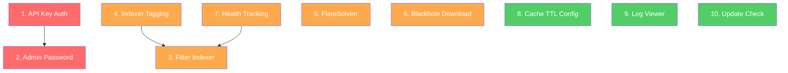

# Lodestarr — Missing Jackett Features: Design Document

This document identifies features present in Jackett (as of v0.24.x, July 2026) that are **missing from Lodestarr**, and provides a detailed, noob-friendly implementation plan for each.

---

## Gap Analysis Summary

| # | Feature | Jackett | Lodestarr | Priority |
|---|---------|---------|-----------|----------|
| 1 | **API Key Authentication** | ✅ Global API key for all Torznab endpoints | ❌ No auth — endpoints are wide open | 🔴 Critical |
| 2 | **Admin Password / Web UI Auth** | ✅ Password-protected dashboard | ❌ No login at all | 🔴 Critical |
| 3 | **Filter Indexer Endpoint** | ✅ `type:`, `tag:`, `lang:`, `test:`, `status:` filters with `!`, `+`, `,` operators | ❌ Only `/all` or specific indexer | 🟡 High |
| 4 | **Indexer Tagging** | ✅ User-defined tags on indexers for grouping | ❌ Not supported | 🟡 High |
| 5 | **FlareSolverr Integration** | ✅ Built-in proxy to bypass Cloudflare | ❌ Not supported | 🟡 High |
| 6 | **Blackhole / Save-to-Disk Download** | ✅ Save `.torrent` files to a watched directory | ❌ Only qBittorrent client + magnet copy | 🟡 High |
| 7 | **Indexer Health Tracking** | ✅ Test pass/fail status, last tested timestamp | ⚠️ Manual test only, no persistent status | 🟢 Medium |
| 8 | **Cache TTL Configuration** | ✅ Configurable per-user | ❌ Hardcoded to 1 hour | 🟢 Medium |
| 9 | **Logging / Log Viewer** | ✅ Real-time log viewer in web UI | ❌ Only `RUST_LOG` to stdout | 🟢 Medium |
| 10 | **External Update Check** | ✅ Auto-update or update notification | ❌ No version checking | 🟢 Medium |

---

## Feature 1: API Key Authentication

### What Jackett Does
Jackett generates a random API key at first launch. Every Torznab API request (`/api/v2.0/...`) must include `?apikey=<key>` or it gets a `401 Unauthorized`. The key is shown on the dashboard and can be regenerated.

### Current Lodestarr State
All API endpoints in [mod.rs](file:///home/pi/src/Lodestarr/src/server/mod.rs) are completely open — no auth middleware.

### Design

#### 1.1 Config Changes — [config.rs](file:///home/pi/src/Lodestarr/src/config.rs)

Add two new fields to the `Config` struct:

```rust
#[derive(Debug, Clone, Serialize, Deserialize, Default)]
pub struct Config {
    // ... existing fields ...
    
    /// API key for Torznab endpoint authentication.
    /// Auto-generated on first launch if empty.
    pub api_key: Option<String>,
    
    /// Admin password hash (bcrypt) for Web UI login.
    /// None = no password required.
    pub admin_password_hash: Option<String>,
}
```

On first launch, if `api_key` is `None`, generate a random 32-char hex string using `uuid` or `rand`, save it to `config.toml`, and log it.

#### 1.2 Middleware — New file: `src/server/auth.rs`

Create an Axum middleware extractor that checks the `apikey` query parameter on Torznab routes:

```rust
use axum::{extract::Query, http::StatusCode, response::IntoResponse};
use serde::Deserialize;

#[derive(Deserialize)]
pub struct ApiKeyParam {
    pub apikey: Option<String>,
}

/// Middleware: validate API key on Torznab routes
pub async fn validate_api_key(
    State(state): State<AppState>,
    Query(params): Query<ApiKeyParam>,
    request: axum::extract::Request,
    next: axum::middleware::Next,
) -> impl IntoResponse {
    let config = state.config.read().await;
    
    // If no API key is configured, allow all requests
    if config.api_key.is_none() {
        return next.run(request).await;
    }
    
    let expected = config.api_key.as_deref().unwrap();
    match params.apikey.as_deref() {
        Some(key) if key == expected => next.run(request).await,
        _ => {
            let xml = crate::torznab::generate_error_xml(100, "Invalid API Key");
            (StatusCode::UNAUTHORIZED, 
             [(axum::http::header::CONTENT_TYPE, "application/xml")],
             xml).into_response()
        }
    }
}
```

#### 1.3 Apply Middleware — [mod.rs](file:///home/pi/src/Lodestarr/src/server/mod.rs)

Wrap only the Torznab API routes with the auth middleware. Internal web UI API routes (`/api/search`, `/api/info`, etc.) should NOT require the API key — they'll be protected by the admin password/session instead.

```rust
// Torznab routes — protected by API key
let torznab_routes = Router::new()
    .route("/api/v2.0/indexers/{indexer}/results/torznab", get(torznab_api))
    .route("/api/v2.0/indexers/{indexer}/results/torznab/api", get(torznab_api))
    .route("/api/v2.0/indexers/{indexer}/dl", get(proxy_download))
    .route("/api/v2.0/indexers/{indexer}/caps", get(get_indexer_caps))
    .layer(axum::middleware::from_fn_with_state(state.clone(), validate_api_key));
```

#### 1.4 Web UI — API Key Display

Add a section to the Settings page showing the current API key with a "Copy" button and a "Regenerate" button.

**New API endpoint:**
- `GET /api/settings/apikey` → returns `{ "api_key": "..." }`
- `POST /api/settings/apikey/regenerate` → generates new key, saves config, returns new key

#### 1.5 Files to Create/Modify

| Action | File | What |
|--------|------|------|
| CREATE | `src/server/auth.rs` | API key validation middleware |
| MODIFY | `src/config.rs` | Add `api_key` and `admin_password_hash` fields |
| MODIFY | `src/server/mod.rs` | Wire up auth middleware on Torznab routes; add `mod auth;` |
| MODIFY | `src/server/api_settings.rs` | Add API key get/regenerate endpoints |
| MODIFY | `web/src/components/Settings.tsx` | Add API key display/copy/regenerate UI |

---

## Feature 2: Admin Password / Web UI Login

### What Jackett Does
Jackett lets you set an admin password. When set, the web dashboard requires login via a form. A session cookie is issued on successful login.

### Design

#### 2.1 Password Hashing

Use `bcrypt` (add `bcrypt = "0.16"` to Cargo.toml). Hash the password on set, verify on login.

#### 2.2 Session Management

Use a simple random token stored in memory (HashMap behind an `Arc<RwLock>`):

```rust
pub struct SessionStore {
    sessions: HashMap<String, SessionInfo>,
}

pub struct SessionInfo {
    created_at: SystemTime,
    expires_at: SystemTime, // 24 hours from creation
}
```

#### 2.3 New Endpoints

| Method | Path | Purpose |
|--------|------|---------|
| `POST` | `/api/auth/login` | Body: `{ "password": "..." }`. Returns session cookie. |
| `POST` | `/api/auth/logout` | Clears session cookie. |
| `GET` | `/api/auth/status` | Returns `{ "authenticated": true/false, "password_set": true/false }` |
| `POST` | `/api/settings/password` | Body: `{ "password": "..." }`. Sets/changes admin password. |

#### 2.4 Middleware

Create `validate_session` middleware that checks for a `lodestarr_session` cookie on ALL `/api/...` routes EXCEPT:
- `/api/auth/login`
- `/api/auth/status`
- `/api/v2.0/...` (these use API key auth instead)

If no admin password is configured, skip the check entirely (open access).

#### 2.5 Web UI

Add a Login page component that shows when `password_set=true` and `authenticated=false`. Store session state in React context.

#### 2.6 Files to Create/Modify

| Action | File | What |
|--------|------|------|
| CREATE | `src/server/auth.rs` | Session store, login/logout handlers, middleware |
| CREATE | `web/src/components/Login.tsx` | Login form component |
| CREATE | `web/src/contexts/AuthContext.tsx` | Auth state context for React |
| MODIFY | `Cargo.toml` | Add `bcrypt = "0.16"` dependency |
| MODIFY | `src/server/mod.rs` | Add auth routes and session middleware |
| MODIFY | `src/config.rs` | Add `admin_password_hash` field |
| MODIFY | `web/src/App.tsx` | Wrap app with AuthContext, show Login page when unauthenticated |

---

## Feature 3: Filter Indexer Endpoint

### What Jackett Does
Jackett supports a powerful filter syntax in the indexer path segment:

```
/api/v2.0/indexers/<filter>/results/torznab?t=search&q=ubuntu
```

Where `<filter>` can be:
- `all` — all configured indexers
- `type:public` — only public indexers
- `tag:movies` — indexers tagged "movies"
- `lang:en` — English-language indexers
- `test:passed` — indexers whose last test passed
- `status:healthy` — healthy indexers
- `!type:private` — NOT private
- `tag:hd+lang:en` — tagged "hd" AND English
- `type:public,type:semi-private` — public OR semi-private

### Current Lodestarr State
[api_indexers.rs](file:///home/pi/src/Lodestarr/src/server/api_indexers.rs) only checks for `"all"` or exact indexer name match. No filtering logic exists.

### Design

#### 3.1 Filter Parser — New file: `src/server/indexer_filter.rs`

```rust
/// Parsed filter expression
pub enum FilterExpr {
    All,
    Exact(String),       // Exact indexer name
    Condition(Vec<FilterClause>),  // Complex filter
}

/// A single OR group (items within separated by `,`)
/// Within each OR group, items are ANDed (separated by `+`)
pub struct FilterClause {
    pub conditions: Vec<FilterCondition>, // ANDed together
}

pub struct FilterCondition {
    pub negated: bool,
    pub filter_type: FilterType,
    pub value: String,
}

pub enum FilterType {
    Type,      // public, semi-private, private
    Tag,       // user-defined tag
    Language,  // language prefix match (e.g., "en")
    Test,      // passed, failed
    Status,    // healthy, failing, unknown
}
```

**Parsing logic:** Split the filter string by `,` to get OR groups. Within each OR group, split by `+` to get AND conditions. Each condition starts with optional `!` for negation, then `type:`, `tag:`, `lang:`, `test:`, or `status:`.

#### 3.2 Applying Filters

For each configured indexer (both proxied and native), evaluate the filter expression:

```rust
fn matches_filter(indexer: &IndexerInfo, filter: &FilterExpr) -> bool {
    match filter {
        FilterExpr::All => true,
        FilterExpr::Exact(name) => indexer.name == *name || indexer.id == *name,
        FilterExpr::Condition(or_groups) => {
            or_groups.iter().any(|clause| {
                clause.conditions.iter().all(|cond| {
                    let matches = match cond.filter_type {
                        FilterType::Type => indexer.indexer_type == cond.value,
                        FilterType::Tag => indexer.tags.contains(&cond.value),
                        FilterType::Language => indexer.language.starts_with(&cond.value),
                        FilterType::Test => indexer.last_test_result == cond.value,
                        FilterType::Status => indexer.health_status == cond.value,
                    };
                    if cond.negated { !matches } else { matches }
                })
            })
        }
    }
}
```

#### 3.3 Update `torznab_api` Handler

In [api_indexers.rs](file:///home/pi/src/Lodestarr/src/server/api_indexers.rs), the `torznab_api` handler currently does:

```rust
Path(indexer): Path<String>
```

Change this to parse the path through the filter parser, then use `matches_filter` to select which indexers to query.

#### 3.4 Files to Create/Modify

| Action | File | What |
|--------|------|------|
| CREATE | `src/server/indexer_filter.rs` | Filter expression parser and matcher |
| MODIFY | `src/server/api_indexers.rs` | Use filter parser in `torznab_api` handler |
| MODIFY | `src/server/mod.rs` | Add `mod indexer_filter;` |

---

## Feature 4: Indexer Tagging

### What Jackett Does
Users can assign arbitrary string tags to indexers (e.g., "movies", "tv", "hd", "anime"). Tags are used with the filter indexer endpoint to create logical groups.

### Current Lodestarr State
No tag support anywhere. [IndexerConfig](file:///home/pi/src/Lodestarr/src/config.rs#L27-L32) only has `name`, `url`, and `apikey`.

### Design

#### 4.1 Config Changes

Add tags to both proxied and native indexer configs:

```rust
// For proxied indexers
#[derive(Debug, Clone, Serialize, Deserialize)]
pub struct IndexerConfig {
    pub name: String,
    pub url: String,
    pub apikey: Option<String>,
    #[serde(default)]
    pub tags: Vec<String>,   // NEW
}
```

For native indexers, store tags in `native_settings`:

```rust
// In the native_settings HashMap, use a special key:
// native_settings["indexer_id"]["_tags"] = "movies,tv,hd"
```

#### 4.2 API Endpoints

| Method | Path | Purpose |
|--------|------|---------|
| `PUT` | `/api/settings/indexer/{name}/tags` | Body: `{ "tags": ["movies", "tv"] }` |
| `GET` | `/api/tags` | Returns all unique tags across all indexers |

#### 4.3 Web UI

Add a "Tags" input on the indexer edit modal ([EditIndexerModal.tsx](file:///home/pi/src/Lodestarr/web/src/components/EditIndexerModal.tsx)). Show tags as colored badges on the indexer list.

#### 4.4 Files to Create/Modify

| Action | File | What |
|--------|------|------|
| MODIFY | `src/config.rs` | Add `tags` field to `IndexerConfig` |
| MODIFY | `src/server/api_settings.rs` | Add tag management endpoints |
| MODIFY | `web/src/components/EditIndexerModal.tsx` | Add tag input UI |
| MODIFY | `web/src/components/Settings.tsx` | Show tags on indexer list |

---

## Feature 5: FlareSolverr Integration

### What Jackett Does
Jackett integrates with [FlareSolverr](https://github.com/FlareSolverr/FlareSolverr) to bypass Cloudflare protection. When a request to an indexer gets a Cloudflare challenge page, Jackett sends the URL to FlareSolverr's `/v1` API, which uses a headless browser to solve the challenge and returns cookies + HTML.

### Current Lodestarr State
[executor.rs](file:///home/pi/src/Lodestarr/src/indexer/executor.rs) uses a basic `reqwest::Client`. No Cloudflare detection or FlareSolverr integration.

### Design

#### 5.1 Config Changes

```rust
pub struct Config {
    // ... existing ...
    
    /// FlareSolverr instance URL (e.g., "http://localhost:8191")
    pub flaresolverr_url: Option<String>,
    
    /// FlareSolverr max timeout in milliseconds (default: 60000)
    #[serde(default = "default_flaresolverr_timeout")]
    pub flaresolverr_timeout: u64,
}
```

#### 5.2 FlareSolverr Client — New file: `src/indexer/flaresolverr.rs`

```rust
use serde::{Deserialize, Serialize};

#[derive(Serialize)]
struct FlareSolverrRequest {
    cmd: String,           // "request.get"
    url: String,
    #[serde(rename = "maxTimeout")]
    max_timeout: u64,
}

#[derive(Deserialize)]
struct FlareSolverrResponse {
    status: String,        // "ok" or "error"
    message: String,
    solution: Option<Solution>,
}

#[derive(Deserialize)]
struct Solution {
    url: String,
    status: u16,
    headers: HashMap<String, String>,
    response: String,      // The HTML body
    cookies: Vec<CookieItem>,
    #[serde(rename = "userAgent")]
    user_agent: String,
}

#[derive(Deserialize)]
struct CookieItem {
    name: String,
    value: String,
    domain: String,
    path: String,
}

pub struct FlareSolverrClient {
    http: reqwest::Client,
    base_url: String,
    max_timeout: u64,
}

impl FlareSolverrClient {
    /// Solve a Cloudflare challenge for the given URL
    pub async fn solve(&self, url: &str) -> Result<(String, Vec<CookieItem>)> {
        let req = FlareSolverrRequest {
            cmd: "request.get".to_string(),
            url: url.to_string(),
            max_timeout: self.max_timeout,
        };
        
        let resp: FlareSolverrResponse = self.http
            .post(format!("{}/v1", self.base_url))
            .json(&req)
            .send().await?
            .json().await?;
        
        if resp.status != "ok" {
            anyhow::bail!("FlareSolverr error: {}", resp.message);
        }
        
        let solution = resp.solution
            .ok_or_else(|| anyhow::anyhow!("No solution returned"))?;
        
        Ok((solution.response, solution.cookies))
    }
}
```

#### 5.3 Integration in SearchExecutor

In [executor.rs](file:///home/pi/src/Lodestarr/src/indexer/executor.rs), modify the HTTP request flow:

1. Make the normal `reqwest` request
2. Check if the response is a Cloudflare challenge (status 403 + body contains `"Just a moment"` or `cf-browser-verification`)
3. If yes, and FlareSolverr is configured:
   - Call `FlareSolverrClient::solve(url)`
   - Extract cookies from the solution
   - Add cookies to the `reqwest::Client` cookie jar
   - Return the HTML from FlareSolverr's solution
4. If no, return the normal response

```rust
async fn fetch_with_flaresolverr(
    &self,
    url: &str,
    flaresolverr: Option<&FlareSolverrClient>,
) -> Result<String> {
    let response = self.client.get(url).send().await?;
    
    if response.status() == 403 || response.status() == 503 {
        let body = response.text().await?;
        if is_cloudflare_challenge(&body) {
            if let Some(fs) = flaresolverr {
                tracing::info!("Cloudflare detected, using FlareSolverr for {}", url);
                let (html, cookies) = fs.solve(url).await?;
                // Store cookies for subsequent requests
                self.apply_cookies(&cookies, url)?;
                return Ok(html);
            } else {
                anyhow::bail!("Cloudflare challenge detected but FlareSolverr not configured");
            }
        }
        return Err(anyhow::anyhow!("HTTP {}: {}", 403, body));
    }
    
    response.text().await.map_err(Into::into)
}

fn is_cloudflare_challenge(body: &str) -> bool {
    body.contains("Just a moment") 
        || body.contains("cf-browser-verification")
        || body.contains("challenge-platform")
}
```

#### 5.4 Web UI Settings

Add a "FlareSolverr" settings section alongside the existing proxy settings:

- URL input field
- Timeout input field
- Test button (calls FlareSolverr's health endpoint)

#### 5.5 Files to Create/Modify

| Action | File | What |
|--------|------|------|
| CREATE | `src/indexer/flaresolverr.rs` | FlareSolverr client |
| MODIFY | `src/indexer/mod.rs` | Add `pub mod flaresolverr;` |
| MODIFY | `src/indexer/executor.rs` | Add Cloudflare detection + FlareSolverr fallback |
| MODIFY | `src/config.rs` | Add `flaresolverr_url`, `flaresolverr_timeout` |
| MODIFY | `src/server/api_settings.rs` | Add FlareSolverr config endpoint |
| MODIFY | `web/src/components/settings/` | Add FlareSolverr settings panel |

---

## Feature 6: Blackhole / Save-to-Disk Download

### What Jackett Does
Jackett allows configuring a "blackhole" directory. When a `.torrent` file is downloaded through Jackett, a copy is saved to this directory. Torrent clients like qBittorrent, Deluge, or Transmission can "watch" this folder and automatically start downloads.

### Current Lodestarr State
[config.rs](file:///home/pi/src/Lodestarr/src/config.rs) has a `download_path` field but it's only used as a generic save path. The [clients/mod.rs](file:///home/pi/src/Lodestarr/src/clients/mod.rs) only supports qBittorrent. There's no "watch folder" / blackhole concept.

### Design

#### 6.1 New Download Client Type

Add a `Blackhole` variant to `ClientType`:

```rust
#[derive(Debug, Clone, Serialize, Deserialize, PartialEq)]
pub enum ClientType {
    TorrServer,
    QBittorrent,
    Blackhole,  // NEW
}
```

#### 6.2 Blackhole Client — New file: `src/clients/blackhole.rs`

```rust
use std::path::Path;
use anyhow::Result;

pub struct BlackholeClient {
    pub directory: String,
    pub save_magnets: bool,  // Save magnet links as .magnet files
}

impl BlackholeClient {
    /// Save a .torrent file to the blackhole directory
    pub async fn save_torrent(&self, filename: &str, data: &[u8]) -> Result<String> {
        let dir = Path::new(&self.directory);
        if !dir.exists() {
            tokio::fs::create_dir_all(dir).await?;
        }
        
        // Sanitize filename
        let safe_name = sanitize_filename(filename);
        let path = dir.join(&safe_name);
        
        tokio::fs::write(&path, data).await?;
        tracing::info!("Saved torrent to blackhole: {:?}", path);
        
        Ok(path.to_string_lossy().to_string())
    }
    
    /// Save a magnet link as a .magnet file
    pub async fn save_magnet(&self, title: &str, magnet: &str) -> Result<String> {
        let dir = Path::new(&self.directory);
        if !dir.exists() {
            tokio::fs::create_dir_all(dir).await?;
        }
        
        let safe_name = sanitize_filename(&format!("{}.magnet", title));
        let path = dir.join(&safe_name);
        
        tokio::fs::write(&path, magnet).await?;
        tracing::info!("Saved magnet to blackhole: {:?}", path);
        
        Ok(path.to_string_lossy().to_string())
    }
}

fn sanitize_filename(name: &str) -> String {
    name.chars()
        .map(|c| if c.is_alphanumeric() || c == '.' || c == '-' || c == '_' { c } else { '_' })
        .collect()
}
```

#### 6.3 Integration

When a download is triggered via `POST /api/download`, check if the selected client is a `Blackhole` type. If so:
1. If the download has a `.torrent` link, fetch the file and save it
2. If the download is a magnet, save it as a `.magnet` file

#### 6.4 Web UI

Add "Blackhole (Watch Folder)" as an option when adding a download client. The form should show:
- Directory path input
- Checkbox: "Also save magnet links as .magnet files"

#### 6.5 Files to Create/Modify

| Action | File | What |
|--------|------|------|
| CREATE | `src/clients/blackhole.rs` | Blackhole download client |
| MODIFY | `src/clients/mod.rs` | Add blackhole module and route downloads to it |
| MODIFY | `src/config.rs` | Add `Blackhole` variant to `ClientType` |
| MODIFY | `web/src/components/settings/` | Add Blackhole client option in client setup form |

---

## Feature 7: Indexer Health Tracking

### What Jackett Does
Jackett tracks the status of each indexer: whether its last test passed or failed, the timestamp of the last test, and error messages. This data feeds into the filter indexer's `test:passed`/`status:healthy` filters.

### Current Lodestarr State
[api_native.rs](file:///home/pi/src/Lodestarr/src/server/api_native.rs) has a `test_native_indexer` endpoint, but test results are not stored anywhere.

### Design

#### 7.1 Database Table

Add a new table in [db.rs](file:///home/pi/src/Lodestarr/src/db.rs):

```sql
CREATE TABLE IF NOT EXISTS indexer_health (
    indexer_id TEXT PRIMARY KEY,
    indexer_type TEXT NOT NULL,        -- 'native' or 'proxied'
    last_test_time DATETIME,
    last_test_passed BOOLEAN,
    last_error TEXT,
    consecutive_failures INTEGER DEFAULT 0,
    -- Computed status: 'healthy' (passed), 'failing' (failed), 'unknown' (never tested)
    status TEXT DEFAULT 'unknown'
)
```

#### 7.2 Status Update

After every test (manual or automated), update the health record:

```rust
pub fn update_indexer_health(
    pool: &DbPool,
    indexer_id: &str,
    indexer_type: &str, // "native" or "proxied"
    passed: bool,
    error: Option<&str>,
) -> anyhow::Result<()> {
    let conn = pool.get()?;
    let status = if passed { "healthy" } else { "failing" };
    let failures = if passed { 0 } else {
        // Increment consecutive failures
        let current: i64 = conn.query_row(
            "SELECT COALESCE(consecutive_failures, 0) FROM indexer_health WHERE indexer_id = ?1",
            params![indexer_id],
            |r| r.get(0),
        ).unwrap_or(0);
        current + 1
    };
    
    conn.execute(
        "INSERT OR REPLACE INTO indexer_health 
         (indexer_id, indexer_type, last_test_time, last_test_passed, last_error, consecutive_failures, status)
         VALUES (?1, ?2, ?3, ?4, ?5, ?6, ?7)",
        params![indexer_id, indexer_type, Utc::now(), passed, error, failures, status],
    )?;
    Ok(())
}
```

#### 7.3 Health Data in API Responses

Include health data when listing indexers:

```json
{
  "id": "yts",
  "name": "YTS",
  "type": "public",
  "status": "healthy",
  "last_tested": "2026-07-12T10:00:00Z",
  "consecutive_failures": 0
}
```

#### 7.4 Web UI

Show a colored status indicator on each indexer:
- 🟢 Green = healthy (last test passed)
- 🔴 Red = failing (last test failed)
- ⚪ Gray = unknown (never tested)

#### 7.5 Files to Create/Modify

| Action | File | What |
|--------|------|------|
| MODIFY | `src/db.rs` | Add `indexer_health` table and CRUD functions |
| MODIFY | `src/server/api_native.rs` | Store test results in health table |
| MODIFY | `src/server/api_settings.rs` | Store proxied indexer test results |
| MODIFY | `src/server/api_indexers.rs` | Include health data in indexer listings |
| MODIFY | `web/src/components/NativeIndexers.tsx` | Show health status badges |
| MODIFY | `web/src/components/Settings.tsx` | Show health status for proxied indexers |

---

## Feature 8: Configurable Cache TTL

### What Jackett Does
Cache TTL is configurable through the web UI.

### Current Lodestarr State
Cache TTL is hardcoded to 1 hour in [api_indexers.rs](file:///home/pi/src/Lodestarr/src/server/api_indexers.rs) (passed to `set_cached_results` as a literal `1`).

### Design

#### 8.1 Config Change

```rust
pub struct Config {
    // ... existing ...
    
    /// Cache TTL in minutes (default: 60)
    #[serde(default = "default_cache_ttl")]
    pub cache_ttl_minutes: u32,
}

fn default_cache_ttl() -> u32 { 60 }
```

#### 8.2 Usage

Replace all hardcoded `1` (hour) calls to `set_cached_results` with:

```rust
let ttl_hours = (config.cache_ttl_minutes as i64 + 59) / 60; // Round up to hours
// Or better: change set_cached_results to accept minutes:
crate::db::set_cached_results(&pool, &key, &json, config.cache_ttl_minutes as i64);
```

Also update `set_cached_results` in [db.rs](file:///home/pi/src/Lodestarr/src/db.rs) to accept minutes instead of hours:

```rust
pub fn set_cached_results(pool: &DbPool, key: &str, results: &str, ttl_minutes: i64) -> anyhow::Result<()> {
    let expires_at = Utc::now() + chrono::Duration::minutes(ttl_minutes);
    // ...
}
```

#### 8.3 Web UI

Add a "Cache TTL" slider/input in the Settings page (range: 0–1440 minutes, 0 = disabled).

#### 8.4 Files to Create/Modify

| Action | File | What |
|--------|------|------|
| MODIFY | `src/config.rs` | Add `cache_ttl_minutes` |
| MODIFY | `src/db.rs` | Change `ttl_hours` to `ttl_minutes` in `set_cached_results` |
| MODIFY | `src/server/api_indexers.rs` | Use config TTL instead of hardcoded value |
| MODIFY | `src/server/api_native.rs` | Use config TTL instead of hardcoded value |
| MODIFY | `src/server/api_settings.rs` | Add cache TTL API endpoint |
| MODIFY | `web/src/components/Settings.tsx` | Add cache TTL input |

---

## Feature 9: Real-Time Log Viewer

### What Jackett Does
Jackett has a "Logs" tab in the web UI that shows real-time application logs, filterable by level (debug, info, warning, error).

### Current Lodestarr State
Logs go to stdout via `tracing-subscriber`. No way to view them in the web UI.

### Design

#### 9.1 In-Memory Log Ring Buffer

Create a custom `tracing` layer that captures log events into a bounded ring buffer:

```rust
use std::collections::VecDeque;
use std::sync::{Arc, Mutex};

pub struct LogBuffer {
    entries: Mutex<VecDeque<LogEntry>>,
    max_size: usize,
}

#[derive(Clone, Serialize)]
pub struct LogEntry {
    pub timestamp: String,
    pub level: String,     // "DEBUG", "INFO", "WARN", "ERROR"
    pub target: String,    // Module path
    pub message: String,
}

impl LogBuffer {
    pub fn new(max_size: usize) -> Self {
        Self {
            entries: Mutex::new(VecDeque::with_capacity(max_size)),
            max_size,
        }
    }
    
    pub fn push(&self, entry: LogEntry) {
        let mut entries = self.entries.lock().unwrap();
        if entries.len() >= self.max_size {
            entries.pop_front();
        }
        entries.push_back(entry);
    }
    
    pub fn get_entries(&self, level: Option<&str>, limit: usize) -> Vec<LogEntry> {
        let entries = self.entries.lock().unwrap();
        entries.iter()
            .filter(|e| level.map_or(true, |l| e.level == l))
            .rev()
            .take(limit)
            .cloned()
            .collect()
    }
}
```

#### 9.2 Tracing Layer

Implement a custom `tracing_subscriber::Layer` that sends events to the buffer.

#### 9.3 API Endpoint

```
GET /api/logs?level=INFO&limit=100
```

Returns the latest log entries as JSON.

#### 9.4 Web UI

Add a "Logs" page/tab with:
- Auto-scrolling log display
- Level filter dropdown (All, Debug, Info, Warn, Error)
- Auto-refresh toggle (poll every 2 seconds)
- Clear button

#### 9.5 Files to Create/Modify

| Action | File | What |
|--------|------|------|
| CREATE | `src/server/log_buffer.rs` | Ring buffer + tracing layer |
| MODIFY | `src/main.rs` | Initialize log buffer, attach as tracing layer |
| MODIFY | `src/server/mod.rs` | Add log buffer to AppState, add `/api/logs` route |
| CREATE | `web/src/components/Logs.tsx` | Log viewer component |
| MODIFY | `web/src/components/Sidebar.tsx` | Add "Logs" nav item |
| MODIFY | `web/src/App.tsx` | Add Logs route |

---

## Feature 10: Update Check / Version Notification

### What Jackett Does
Jackett checks GitHub releases for new versions and shows a notification in the dashboard. It can also auto-update (though many disable this in Docker).

### Current Lodestarr State
The version is set in [Cargo.toml](file:///home/pi/src/Lodestarr/Cargo.toml) (`0.4.2-0`) but no update checking exists.

### Design

#### 10.1 GitHub Release Check

```rust
#[derive(Deserialize)]
struct GitHubRelease {
    tag_name: String,
    html_url: String,
    published_at: String,
    body: String,
}

async fn check_for_updates(current_version: &str) -> Result<Option<UpdateInfo>> {
    let client = reqwest::Client::new();
    let release: GitHubRelease = client
        .get("https://api.github.com/repos/ddonindia/lodestarr/releases/latest")
        .header("User-Agent", "Lodestarr")
        .send().await?
        .json().await?;
    
    let latest = release.tag_name.trim_start_matches('v');
    if latest != current_version {
        Ok(Some(UpdateInfo {
            current_version: current_version.to_string(),
            latest_version: latest.to_string(),
            release_url: release.html_url,
            changelog: release.body,
        }))
    } else {
        Ok(None)
    }
}
```

#### 10.2 Background Task

On server startup, spawn a background task that checks every 6 hours. Store the result in `AppState`:

```rust
pub struct AppState {
    // ... existing ...
    pub update_info: Arc<RwLock<Option<UpdateInfo>>>,
}
```

#### 10.3 API Endpoint

```
GET /api/update-check → returns UpdateInfo or null
```

#### 10.4 Web UI

Show a subtle banner at the top of the dashboard when an update is available:

> 🔔 Lodestarr v0.5.0 is available! [View Release](https://github.com/...)

#### 10.5 Files to Create/Modify

| Action | File | What |
|--------|------|------|
| CREATE | `src/server/update_checker.rs` | GitHub release checker + background task |
| MODIFY | `src/server/mod.rs` | Add update_info to AppState, spawn checker, add route |
| MODIFY | `web/src/components/Dashboard.tsx` | Show update notification banner |

---

## Implementation Order (Recommended)

The features above are ordered by dependency chain and priority:



| Phase | Features | Effort Estimate |
|-------|----------|-----------------|
| **Phase 1** | API Key Auth + Admin Password | ~2-3 days |
| **Phase 2** | Indexer Tagging + Health Tracking | ~2 days |
| **Phase 3** | Filter Indexer Endpoint (depends on Phase 2) | ~1-2 days |
| **Phase 4** | FlareSolverr Integration | ~2 days |
| **Phase 5** | Blackhole Download + Cache TTL | ~1 day |
| **Phase 6** | Log Viewer + Update Check | ~2 days |

**Total estimate: ~10-12 days** for an experienced Rust developer, ~15-20 days for someone newer to the codebase.

---

## Open Questions

> [!IMPORTANT]
> **Dependency decision needed:** Should we add `bcrypt` for password hashing (Feature 2), or use a lighter option like `argon2` or just SHA-256 + salt? `bcrypt` is well-tested but adds ~50KB to binary size.

> [!IMPORTANT]
> **FlareSolverr scope:** Should FlareSolverr integration be automatic (detect Cloudflare and call FlareSolverr transparently), or should it be opt-in per indexer via a checkbox in settings?

> [!NOTE]
> **Newznab support** was considered but deliberately excluded. Jackett's Newznab support is limited, and Lodestarr's README explicitly states "Torrents only (for now)". This can be a separate future project.
