# Lodestarr Web UI

This is the frontend dashboard for Lodestarr, built with React, TypeScript, and Tailwind CSS.

## Overview

The Web UI provides a modern, Sonarr-inspired interface for managing indexers (both native and proxied via Jackett/Prowlarr), configuring settings, and searching across all aggregated sources. Features include:

- **Native Indexers**: Built-in support for popular indexers using [Jackett definitions](https://github.com/Jackett/Jackett)
- **Unified Search**: Query all indexers (native + proxied) simultaneously
- **Sonarr-like UI**: Professional sidebar navigation with tabbed settings
- **Dark/Light/Auto Themes**: Customizable appearance with accent color options

## Tech Stack

- **Framework**: [React 19](https://react.dev)
- **Build Tool**: [Vite](https://vitejs.dev)
- **Styling**: [Tailwind CSS v4](https://tailwindcss.com)
- **Icons**: [Lucide React](https://lucide.dev)
- **Charts**: [Recharts](https://recharts.org)

## Development

### Prerequisites

- Node.js v20+
- npm

### Setup

```bash
cd web
npm install
```

### Running Locally

To start the development server with Hot Module Replacement (HMR):

```bash
npm run dev
```

The dev server usually runs on `http://localhost:5173`. Make sure your Rust backend is running on `http://localhost:3420` to serve API requests (configure proxy if needed or rely on CORS).

## Building for Production

The build process compiles TSX/CSS into static assets in the `dist/` folder.

```bash
npm run build
```

The output `dist` folder is automatically embedded into the Rust binary at compile time using `rust-embed`.

## Integration with Backend

How it works:
1. `npm run build` generates `web/dist`.
2. `src/server.rs` uses `#[derive(RustEmbed)]` to embed `web/dist`.
3. The binary serves `index.html` for the root path and assets for static requests.
4. `build.rs` in the root automatically triggers `npm run build` during `cargo build` if assets are missing.

## Testing

Lodestarr Web UI includes a strictly typed Puppeteer test suite for end-to-end verification and visual regression testing.

### Running Tests

The test suite automatically starts a test server on a dynamic port. No manual server startup required:

```bash
npm test
```

Run tests with a visible browser window (useful for debugging):
```bash
npm run test:headed
```

**Note**: Tests run against a self-managed test server (auto-started/stopped). The suite enforces **Dark Mode** for screenshot consistency.

### Screenshot Generation

The documentation images are automatically generated by the test suite. To regenerate them:

1.  Ensure your server is running.
2.  Run the screenshot suite:
    ```bash
    npm test tests/ui/screenshots.test.ts
    ```
3.  Run the dashboard suite (for dynamic metrics):
    ```bash
    npm test tests/ui/dashboard.test.ts
    ```

**Note**: The test suite automatically enforces **Dark Mode** to ensure consistent screenshots, regardless of your system default.

### Environment Variables

- `HEADLESS`: Set to `false` to see the browser.
- `BASE_URL`: Override the target server URL (default: `http://localhost:3420`).
- `PUPPETEER_EXECUTABLE_PATH`: Custom Chromium path (default: `/usr/bin/chromium` for ARM/Pi compatibility).

## Comprehensive Test Screenshots

The following screenshots are automatically captured by the `comprehensive.test.ts` suite, documenting all 21 UI validation scenarios.

### Search & Filtering

| # | Screenshot | Description |
|---|------------|-------------|
| 1 | 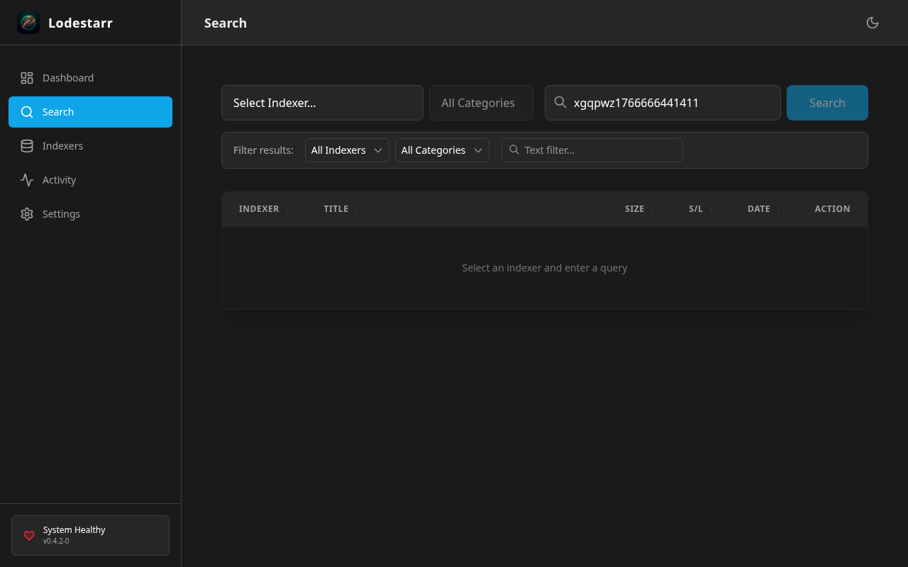 | **No Results**: Empty table for non-matching queries |
| 2 |  | **Clear Input**: Search input reset to empty |
| 3 |  | **Filter by Indexer**: Dropdown filtering applied |
| 4 |  | **Filter by Text**: Title-based filtering |
| 5 | 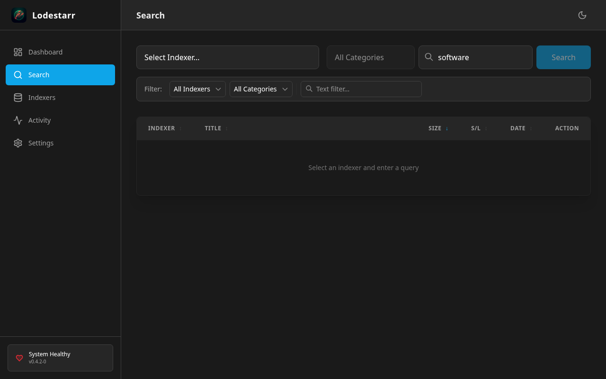 | **Sort Size (Asc)**: Sorted by file size ascending |
| 6 |  | **Sort Size (Desc)**: Sorted by file size descending |
| 7 | 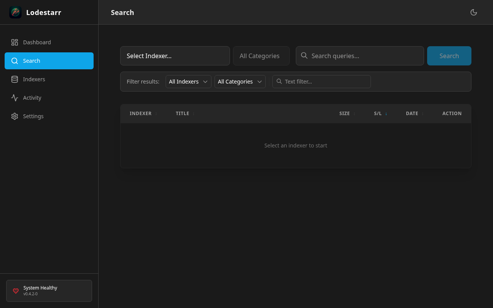 | **Sort Seeders (Asc)**: Sorted by seeders ascending |
| 8 | 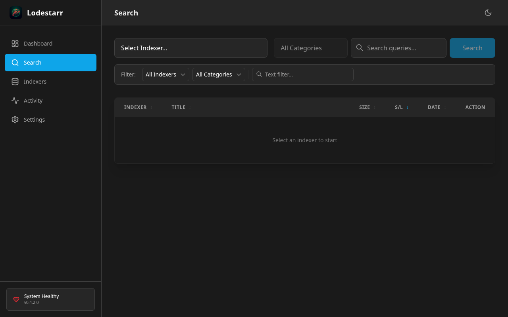 | **Sort Seeders (Desc)**: Sorted by seeders descending |

### User Interactions

| # | Screenshot | Description |
|---|------------|-------------|
| 10 | 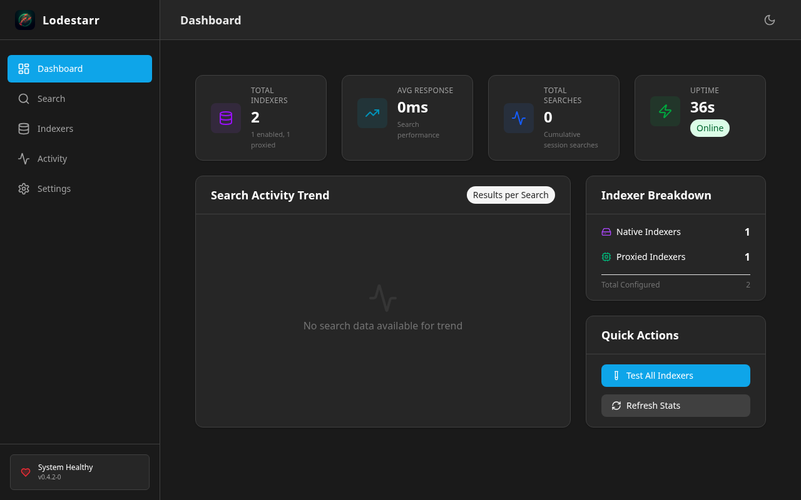 | **Download Button**: Interaction check on Dashboard |
| 12 | 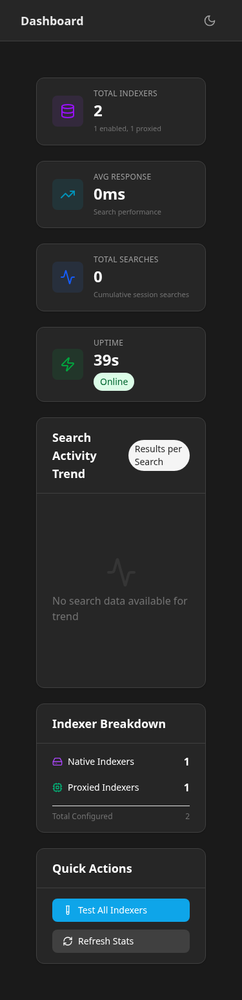 | **Mobile Layout**: Responsive view at 375px width |
| 13 | 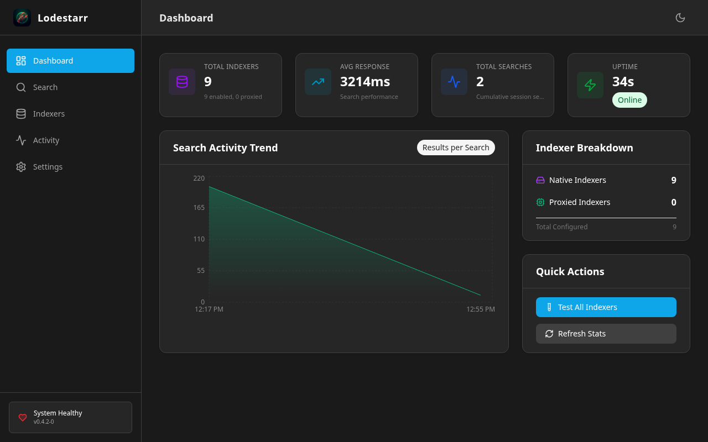 | **Toast Area**: Notification space on Dashboard |

### Indexer Management

| # | Screenshot | Description |
|---|------------|-------------|
| 14 |  | **Empty Form**: Save button disabled when name empty |
| 15 | 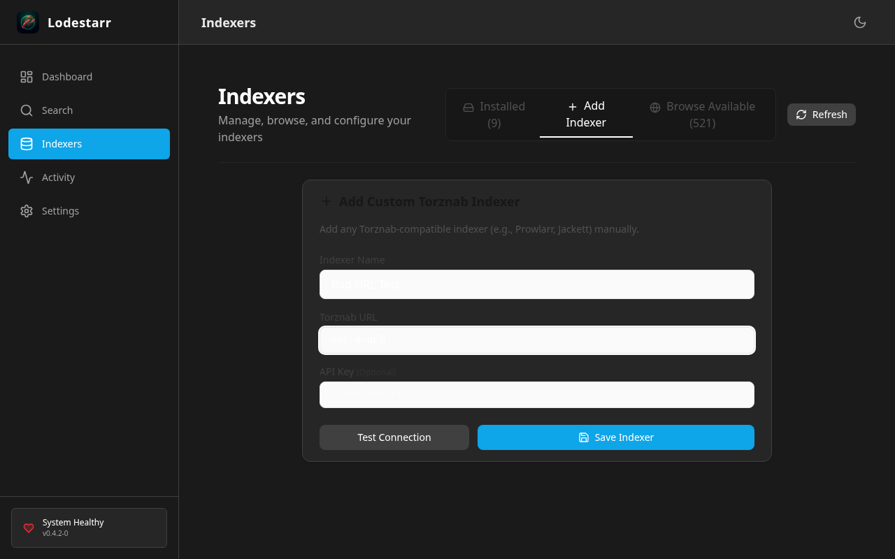 | **Invalid URL**: Form with invalid URL entered |
| 16 | 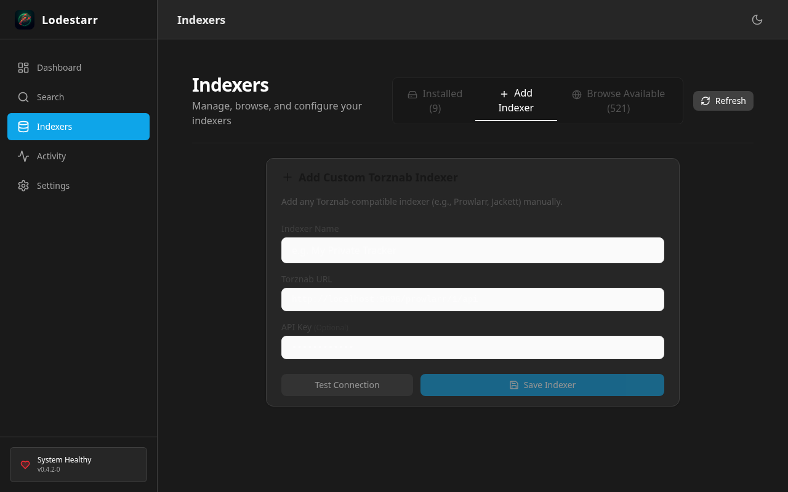 | **Add Form**: Complete form with Test Connection |
| 17 | 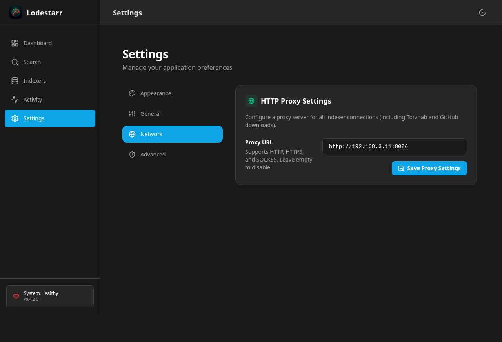 | **Settings Page**: Proxy configuration panel |
| 18 |  | **Toggle Indexer**: Enable/Disable functionality |
| 19 | 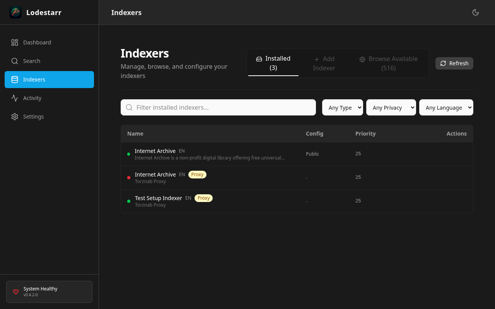 | **Delete Button**: Indexer removal action |
| 20 | 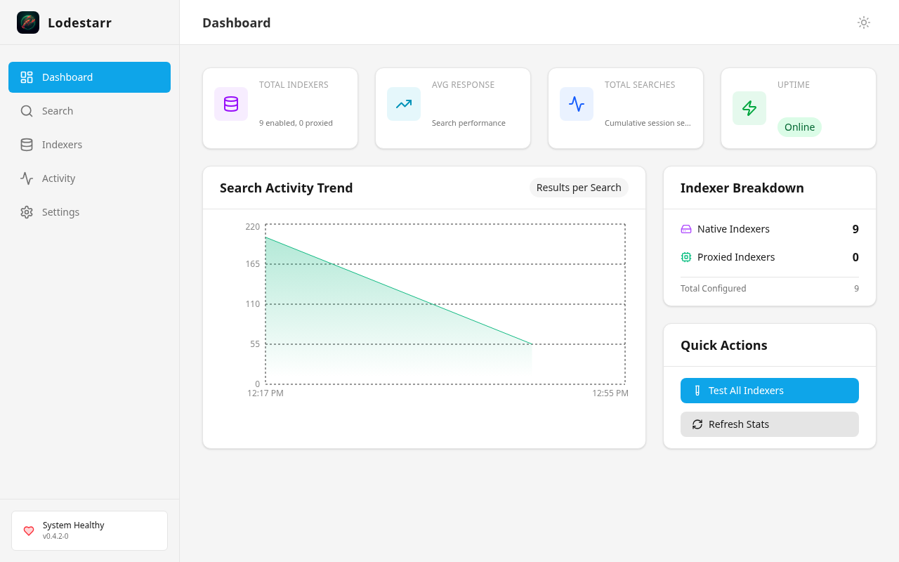 | **Theme Toggle**: Light/Dark mode persistence |
| 21 | 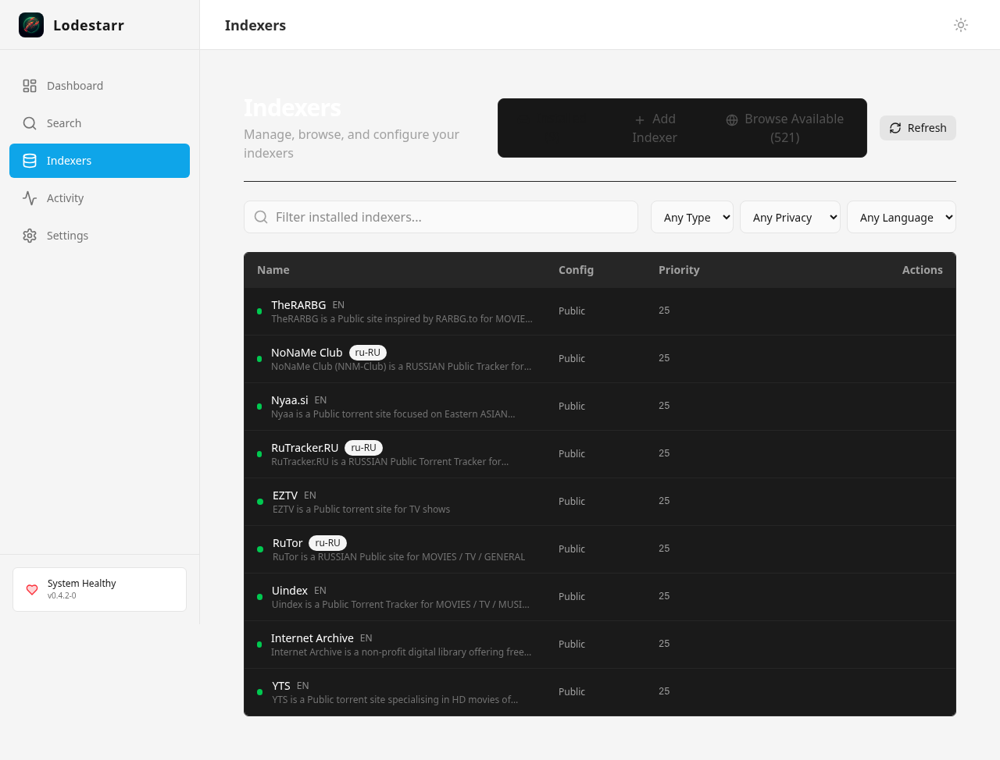 | **Indexer Cards**: Card-based indexer list |

